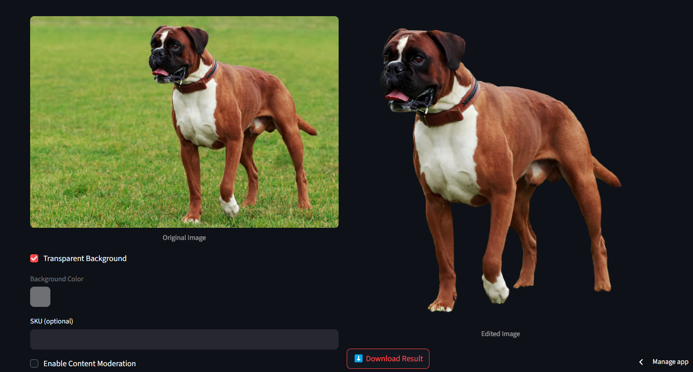

# ImaGen Editor

A modern, lightweight **Streamlit**-based image editor for customizing backgrounds, adding realistic shadows, and enhancing photos using the **Bria AI API**.

---

## Overview

**ImaGen Editor** is a web-based tool designed for anyone looking to enhance images with ease — from casual users to digital creators. Whether you're removing a background, applying shadow effects, or simply refining an image, this app offers intuitive controls and real-time previews — all powered by AI.

---

##  Key Features

- 🎨 **Background Editor**: Easily remove or change the background color of any image.
- 🌫️ **Shadow Editor**: Add drop or natural shadows with customizable blur, offset, intensity, and color.
- 🛡️ **Content Moderation** *(Optional)*: Ensure uploaded images are appropriate via AI moderation.
- 🏷️ **SKU Support**: Tag your images with custom labels or SKUs.
- 🔍 **Real-Time Preview**: Instantly view original vs. edited versions.
- ⬇️ **Download Options**: Save your edited image in high-quality PNG format.
- 💻 **Simple UI**: Streamlined layout with tabbed editing tools and expandable controls.

---

## Screenshots

---

## How to Use

### Step 1: Enter API Key
- Automatically loaded from `.env`, or enter it manually via sidebar.

### Step 2: Choose a Tab
- **Background Editor**: Upload an image, remove its background, or apply a custom color.
- **Shadow Editor**: Add drop/natural shadows and fine-tune intensity, offset, blur, and background color.

### Step 3: Preview & Download
- Process your image with one click.
- Preview it side-by-side and download the final version in PNG format.

---

## Example Workflow

1. Upload any image (portrait, logo, item, etc.).
2. Use **Background Editor** to apply a solid background or make it transparent.
3. Use **Shadow Editor** to add depth with a soft natural shadow.
4. Save your edited image for use on social media, websites, or print.

---

## API Integration

**Bria AI API** endpoints used:

- **Remove Background**  
  `https://engine.prod.bria-api.com/v1/background/remove`

- **Add Shadow**  
  `https://engine.prod.bria-api.com/v1/product/shadow`

For more info, visit the [Bria API Docs](https://bria.ai).

---

## Troubleshooting

| Problem | Solution |
|--------|----------|
| **API Key Not Working** | Make sure it's set in `.env` as `BRIA_API_KEY`. |
| **Upload Fails** | Ensure file is PNG, JPG, or JPEG. |
| **API Error 422** | Image may be blocked due to moderation settings. |
| **Image Not Displaying** | Check if a valid image URL is returned from the API. |

---

## Conclusion

**ImaGen Editor** simplifies the process of image enhancement by combining an intuitive interface with powerful AI capabilities. Whether you're preparing visuals for personal use, content creation, or branding — this tool helps you create clean, professional-quality images with just a few clicks.  

**Try the Live App → [imagen-image-background-generator.streamlit.app](https://imagen-image-background-generator.streamlit.app)**  

